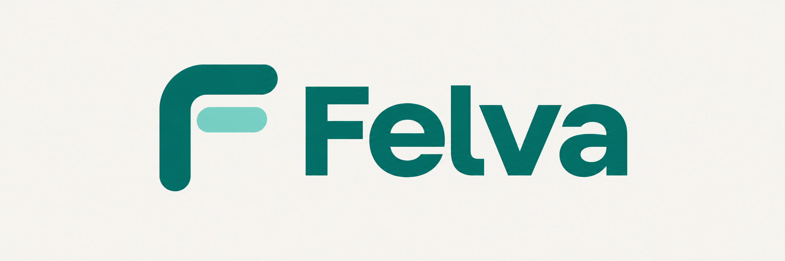

Control Claude Code and Codex on your Mac from your Android phone.

Send a prompt, watch the reply and tool activity, answer questions, or stop a turn.
Close the app and the Mac keeps working. Open it again to catch up.

[Download the APK](https://github.com/20ns/pocketbridge/releases/latest) · [Mac setup](mac/README.md) · [Android build](android/README.md)

Felva was previously called PocketBridge. The Android package, launchers, APK filenames
and data folder still use that name, so the setup paths below do too.

## What you can do

- Open discovered projects, register a folder on the Mac, and start or reopen chats.
- Continue an existing Terminal or desktop session. Phone prompts become part of that same session.
- Steer a running turn, interrupt it with Send now, or stop it.
- Attach screenshots and use the project's commands and skills.
- Choose models, effort and permission mode in the composer. The installed CLIs supply the model lists.
- Check plan usage, get alerts when work finishes or needs an answer, and schedule a prompt for a reported limit reset.

The Mac runs the official, unmodified CLIs. Each CLI keeps its own login.
Chat history and delivery state live on the Mac; reconnecting fetches saved history.
Retries reuse a delivery ID, so a lost response does not run the prompt twice.
After a service crash, running work is marked interrupted and commands are never repeated automatically.

## Get started

You need a Mac, Node.js 22.13 or newer, PNPM, Tailscale, and at least one of the
official Claude Code or Codex CLIs. Sign in through `claude` or `codex login`
in Terminal before starting Felva. The phone needs Android 8 or newer.

On the Mac:

```sh
git clone https://github.com/20ns/pocketbridge.git
cd pocketbridge/mac
pnpm install
open launcher/PocketBridge.command
```

The launcher starts the service and opens the Mac browser client. Choose a
discovered project or add a folder there.

1. Install Tailscale on the Mac and sign in.
2. Open `Setup phone connection.command` in `mac/launcher/`. Follow any Tailscale prompt to enable HTTPS or Funnel.
3. Install the signed APK from [Releases](https://github.com/20ns/pocketbridge/releases/latest).
4. In the Mac client, choose Connect phone, then Create pairing code.
5. Scan the QR with your phone camera, or enter the HTTPS address and code in the app.

The default connection uses Tailscale Funnel. The phone needs no VPN or Tailscale app.
Only paired phone tokens work remotely. Remove a phone in the Mac client to cut off its access immediately.

For a connection inside your tailnet, run this from the repository root:

```sh
node mac/scripts/setup-connection.mjs --tailnet-only
```

This uses Tailscale Serve and requires Tailscale on the phone in the same tailnet.
Both setups forward to the phone port, 8789 by default. The Mac browser uses
loopback port 8787. Never forward that browser port.

Keep the Mac awake, online, plugged in and logged in, with its lid open.
For login startup, open `mac/launcher/Install startup.command`.
Configuration and troubleshooting are in the [Mac guide](mac/README.md).

## A few things to know

Bypass permissions is the default and gives the CLI broad access under your Mac account.
Auto is an explicit alternative. Felva never silently changes permission modes.

Project discovery reads folder metadata, without importing old conversations.
Continuing a session resumes it in place and copies only its last exchange into the chat.
Avoid running the same session here and in Terminal or the desktop app at the same time.

Stop interrupts work but leaves completed edits in place. CLI logins, plan limits
and Tailscale access are independent of saved pairing. Runtime data, tokens and
signing keys stay out of the public repository.

## Updates

Settings can download newer signed releases and open Android's installer.
Install over the existing app to preserve pairing and drafts. Do not uninstall first.

The Mac can also serve an APK at `/PocketBridge.apk` once you copy one to
`mac/public/PocketBridge.apk`.

<details>
<summary>Release signing and publishing</summary>

Pushes to `main` and pull requests run Mac tests and the Android build, unit tests and lint.
To publish, increase `versionCode` and `versionName` in
`android/app/build.gradle.kts`, edit [RELEASE-NOTES.md](RELEASE-NOTES.md), push,
and manually run Checks and APK release in GitHub Actions.

The repository secret `APK_SIGNING_KEY` holds the original personal signing key.
The maintainer's local copy is `~/.android/debug.keystore`; keep a private backup.
Another Mac's generated debug keystore is a different key and cannot update the official APK.

Release APKs retain the original personal debug certificate for update compatibility
and disable debugging. This distribution is for personal sideloading.
A Play Store release needs its own signing and publication setup.

With the original key, build from `android/`:

```sh
POCKETBRIDGE_SIGNING_KEY="$HOME/.android/debug.keystore" ./gradlew assembleRelease testDebugUnitTest lintRelease
```

</details>

## Working on Felva

The Android app uses Kotlin and Jetpack Compose, targets Android 16, API 36,
and builds with JDK 21 and Android SDK platform 36.
The Mac service uses Node.js and its built-in SQLite.

From `mac/`:

```sh
pnpm test
```

From `android/`:

```sh
./gradlew assembleDebug testDebugUnitTest lintDebug
```

See [TEST-REPORT.txt](TEST-REPORT.txt) for verification, with emulator checks
recorded separately from physical phone tests.

| Where | What |
| --- | --- |
| [android/](android/README.md) | Native phone app and build instructions |
| [mac/](mac/README.md) | Mac service, browser client, connection setup and launchers |
| [PROTOCOL.md](PROTOCOL.md) | Shared HTTP and streaming contract |
| [PRODUCT.md](PRODUCT.md) | Scope and operating assumptions |
| [AGENTS.md](AGENTS.md) | Contributor instructions |
